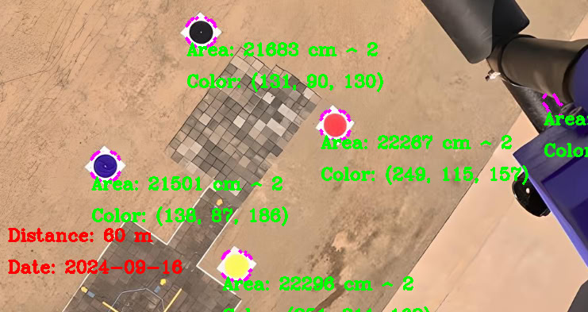
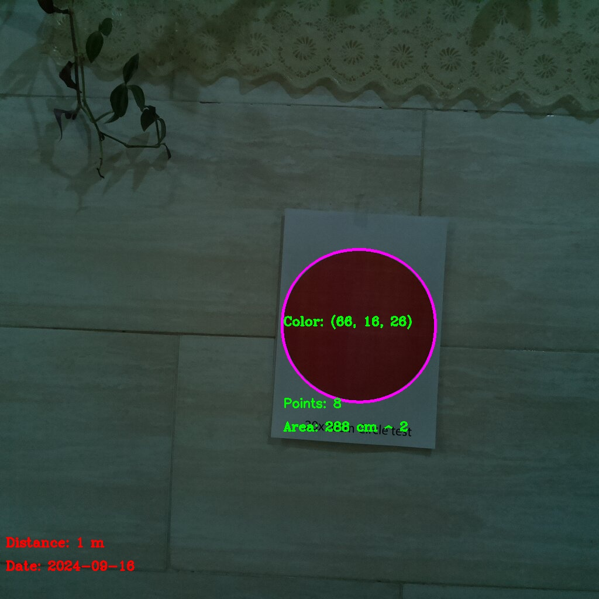
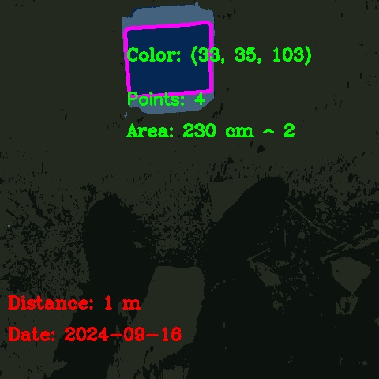

#Shape Detection With Python

shape detection script written in python for CanSat competition.
here are some pictures processed with the script:

you can play with the trackbars and get the best result out of the image.
just hit 's' to save the image in the outputImages directory.

you can also hit 'c' button to quantizate the image and make it more simple to process.
in cases when the image is blurred and hard to process you can use this feature.

here is an example of it:
